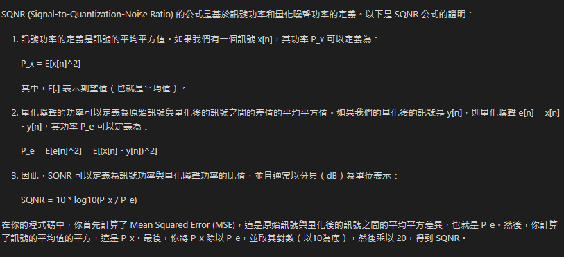

# 2D convolution 計算流程
1. 選擇一個卷積核，例如3X3的卷積核
2. 將卷積核放在圖像的左上角，計算卷積核與圖像的乘積，得到一個數值
3. 將卷積核向右移動一個像素，當卷積核移動到圖像的右邊時，將卷積核向下移動一個像素，重複步驟2
5. 當卷積核移動到圖像的底部時，計算結束

## fixed-point定義
1. 一個定點數是一個整數，它的小數點位置是固定的，例如，如果我們有一個8位的數字，其中4位是整數，4位是小數，那麼這個數字的範圍是-8到7.9375
2. 這種表示法的好處是可以用整數來表示小數，這樣就可以用整數運算來代替浮點運算，從而提高運算速度

## SQNR定義
1. SQNR是信號與量化誤差之比，是一個信號的品質指標，信號越大，量化誤差越小，SQNR越大，信號品質越好
2. SQNR的計算公式為：SQNR = 20 * log10(信號的平方和 / 量化誤差的平方和)  

*此次專案要求計算36個output值做平均後計算SQNR，SQNR值需 > 30 dB 公式變更為：SQNR = 20 * log10(信號(float 的output)的平方和平均 / 量化(float 與 fixed-point output)誤差的平方和)平均*

