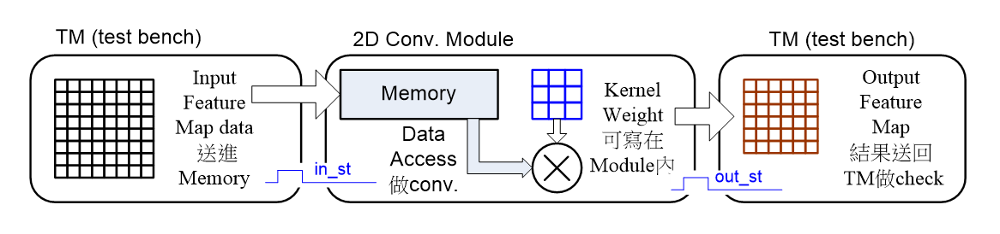

# Two-Dimension (2D) Convolution Processor Design

## 介紹
此專案來自中原大學硬體描述語言Final Project，目的是設計一個2D Convolution Processor。2D Convolution Processor是一個可以對2D圖像進行卷積運算的硬體，透過卷積運算可以對圖像進行特徵提取，是影像處理中常用的技術之一。

## 硬體架構分為兩種
1. 依照TM依序拿取Data，並進行Convolution運算

2. 透過Memory Controller來控制Memory，並透過DMA來取得Data，Data Access並進行Convolution運算

## 乘法器分為兩種
1. 使用一般乘法 Signed(a*b)
2. 使用two-cycle乘法

## 配分
Final Project Grading (40 %)
1.  基本work (沒有寫Verilog)(5~10分)
    1.  Study 2D Conv.運算方式，以軟體(C, Python, Excel, 手算)做出一組2D Conv. (size如第一頁的規格)之運算結果(floating-point) 。(5%)
    2. 根據a.的floating-point運算內容，得出其fixed-point值的運算結果(8-bit  16-bit)，並計算其SQNR(由36個output值做平均後計算SQNR，SQNR值需 > 30 dB)。(10%)
2. 基於1. ，有寫Verilog Code，但Compile不過或無法執行模擬(e.g.輸出為X) (10~15分)
3. 基於1.， Verilog Code可以Compile與模擬(即有跑出值)，但結果不正確。(15~25分)
    1. 以”架構1/乘法器1”的方式。(15分)  
    2. 以”架構2/乘法器1”的方式。(20分)
    3. 以”架構2/乘法器2”的方式。(25分) **PS: 倘若in_st或out_st沒有正確出現>>扣3分**
4. 基於1.， Verilog Code可以Compile與模擬(即有跑出值)，且結果正確。(25~35分)

    1. 以”架構1/乘法器1”的方式。(25分)   
    2. 以”架構2/乘法器1”的方式。(30分)
    3. 以”架構2/乘法器2”的方式。(35分)   “PS: 倘若in_st或out_st沒有正確出現>>扣3分”
5. 基於4.， 進階加上以下的設計內容。(+5分) (四選一，視成果加分)
    1. 完成一組Conv. “層”的運算(e.g., 兩個input feature maps;四個output feature maps)。
    2. 你的設計可以設定執行“3 x 3”或“5 x 5”兩種規格的kernel運算。
    3. 將你的設計進一步合成出電路做模擬或測試(FPGA Quartus/Vivado Tool或其他)。
    4. 提出你自己對設計優化的想法(找老師check)